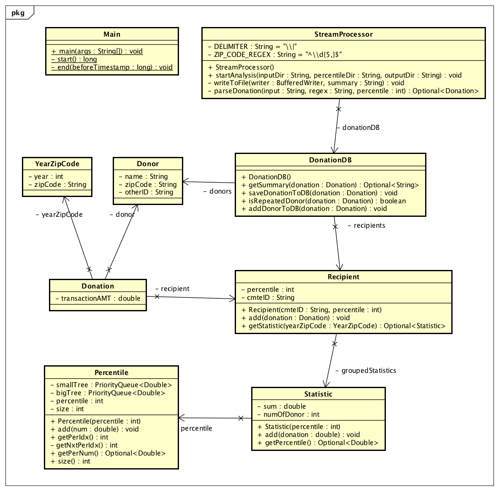
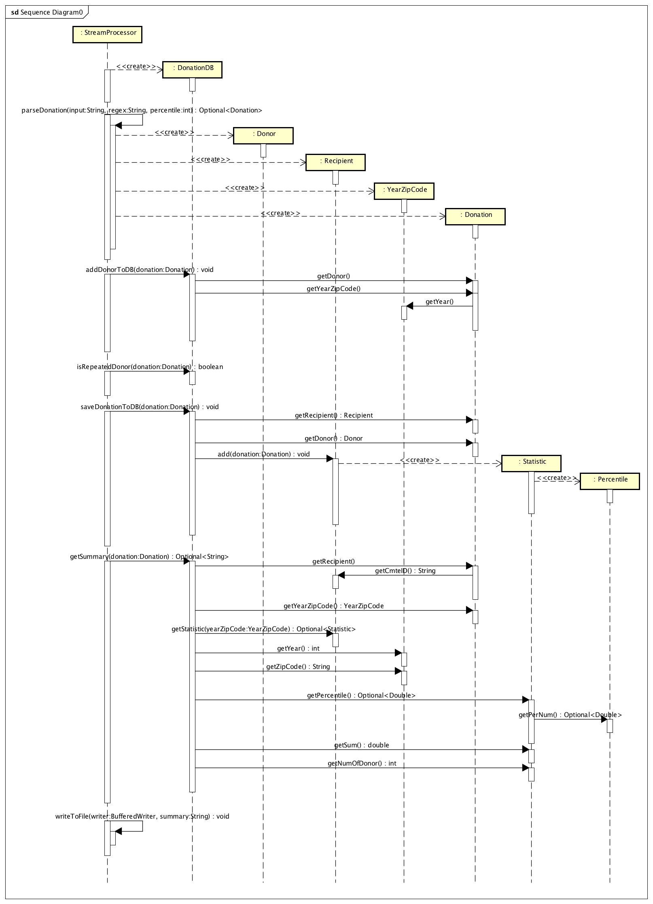

# Table of Contents
1. [Summary](README.md#summary)
2. [Data Structures and Algorithms Analysis](README.md#data-structures-and-algorithms-analysis)
3. [Tests](README.md#tests)
4. [Diagrams](README.md#diagrams)

# Summary

This project is about solving [coding challenge](https://github.com/InsightDataScience/donation-analytics) from [Insight Data Engineering Program](http://insightdataengineering.com). My approach solving the problem relies heavily on Java 8 `stream`, `lambda` as well as other functional programming paradigms (e.g. immutable objects) which are well suited for handling streaming data.

## Depedencies

* Java 8 (Required)
* Maven 3.5.2 (Required)
* lombok 1.16.18 (Added in pom.xml and will be downloaded by Maven)
* JUnit 4.8.1 (Added in pom.xml and will be downloaded by Maven)

Java is relatively verbose comparing with other modern programming languages. [lombok](https://projectlombok.org) helps making the code compact with automatically generated `Constructor` and common methods such as `Getter`, `Setter`, `hashCode`, `equals` using Java annotation. Notice that with `exclude` in `@EqualsAndHashCode`, we still have full control of the implementation of `hashCode` and `equals` method. It helps programmers focusing on most important part of the code. 

```java
@Getter
@AllArgsConstructor
@EqualsAndHashCode(exclude = "otherID")
public class Donor {
    private final String name;
    private final String zipCode;
    private final String otherID;
}
```

## How to run

The jar file for this project is checked in Github. Therefore, cloning this repository and executing `run.sh` should work just fine. In case, the binary file is corrupted or does not work on your computer. One ways is uncomment the second command in `run.sh` as indicated below. The `run.sh` will compile the jar file every time your run it. Or, simply, just execute `mvn clean package -Dmaven.test.skip=true` under `./src/DonationAnalytics` directory before running `run.sh`.

```shell
$ cat run.sh
#!/bin/bash
cd src/DonationAnalytics
# mvn clean package -Dmaven.test.skip=true # <- uncomment this line
java -cp ./target/donation-analytics-1.0-SNAPSHOT.jar com.khwu.analytics.Main ../../input/itcont.txt ../../input/percentile.txt ../../output/repeat_donors.txt
```

Also, make sure you've setup Java and Maven in your path. You can test them with `java -version` and `mvn -version`.

```shell
$ java -version
java version "1.8.0_151"
Java(TM) SE Runtime Environment (build 1.8.0_151-b12)
Java HotSpot(TM) 64-Bit Server VM (build 25.151-b12, mixed mode)
$ mvn -version
Apache Maven 3.5.2 (138edd61fd100ec658bfa2d307c43b76940a5d7d; 2017-10-18T00:58:13-07:00)
Maven home: /usr/local/Cellar/maven/3.5.2/libexec
Java version: 1.8.0_151, vendor: Oracle Corporation
Java home: /Library/Java/JavaVirtualMachines/jdk1.8.0_151.jdk/Contents/Home/jre
Default locale: en_US, platform encoding: UTF-8
OS name: "mac os x", version: "10.13.3", arch: "x86_64", family: "mac"
```

## Project Structure

Be aware the tree structure below only display directories under `./src`.

```shell
$ tree -I "target" ./src
./src
└── DonationAnalytics
    ├── DonationAnalytics.iml
    ├── pom.xml
    └── src
        ├── main
        │   ├── java
        │   │   └── com
        │   │       └── khwu
        │   │           └── analytics
        │   │               ├── Donation.java
        │   │               ├── DonationDB.java
        │   │               ├── Donor.java
        │   │               ├── Main.java
        │   │               ├── Percentile.java
        │   │               ├── Recipient.java
        │   │               ├── Statistic.java
        │   │               ├── StreamProcessor.java
        │   │               └── YearZipCode.java
        │   └── resources
        └── test
            └── java
                └── com
                    └── khwu
                        └── analytics
                            ├── DonationDBTest.java
                            ├── MainTest.java
                            ├── PercentileTest.java
                            ├── RecipientTest.java
                            └── StreamProcessorTest.java
```

# Data Structures and Algorithms Analysis

## tldr

* Average: O(log(n))
* Best: O(log(n))
* Worst: O(log<sup>2</sup>(n))

**This performance analysis is from the angle of each streaming data where `n` is the amount of the valid donations already stored in memory.** The bottleneck performance of the program is adding donation to `Percentile` which is O(log(n)). Whereas, the worst case performance is O(log<sup>2</sup>(n)) and is only theoretically possible. Two key analyses are discussed in detail below. Before continuing, you might want to jumpt to [Diagrams](README.md#diagrams) to get familiar with who are the actors and how they interact.

## Look up `Donor` with a given year:

### Time Complexity

* Average: O(1)
* Best: O(1)
* Worst: O(log<sup>2</sup>(n))

### Space Complexity

* O(n)

### Key data strucuture

* HashSet
* HashMap

### Description:

For every successfully parsed data, we need to check the donor of a given donation is a repeated donor before we write to file. Therefore, we need an efficient way for quick way of looking up donors from previous year. I used `HashMap` along with `HashSet` creating lookup table like `HashMap<Integer, HashSet<Donor>>`. The `hashCode` and `equals` of `Donor` is comparing and hashing with `name` and `zipCode` so that donor with same `name` and `zipCode` would be identified as same donor effectively. Since Java 8, the HashMap has replace LinkedList with Binary Tree. This means under worst case scenario (all keys collides to same index), HashMap  still guarantees O(log(n)) performance. You can read it from [here](https://www.nagarro.com/de/perspectives/post/24/performance-improvement-for-hashmap-in-java-8). Additionally, HashSet is internally implemented by HashMap but without value and therefore guarentees O(1) performance on average but O(log(n)) in worst case.

Other quick lookups are implemented likewise (having same best and average performance but O(log(n)) in worst case since there is no addtional `HashSet` in the value of `HashMap`):

* Look up `Recipient` by its `cmteID` using `HashMap<String, Recipient>`.
* Look up `Statistic` object with a given `YearZipCode` (Not calculating the percentile) using `HashMap<YearZipCode, Statistic>`.

## Adding donation to `Percentile`:

### Time Complexity

* Average: O(log(n))
* Best: O(log(n))
* Worst: O(log(n))

### Space Complexity

* O(n)

### Key data strucuture

* PriorityQueue

### Description:

In practice, adding donations to `Percentile` is the bottleneck for this program. To minimize computational cost, I use two sets of `PriorityQueue` naming them `smallTree` and `bigTree`. `smallTree` has maximum value at root; `bigTree` has minimum value at root. The k<sup>th</sup> percentile is maintained as the root of `smallTree`. First, if the incoming donation is smaller or equal to the value at the root of the `smallTree`, the value would be add to the `smallTree`. Then, if this would cause k<sup>th</sup> percentile to misplace to the `bigTree`, then the root is going to add to the `bigTree`. Similiar logic if the incoming donation is greater than the root of the `smallTree`. After adding value in the `Percentile`, the performance for retrieving k<sup>th</sup> percentile is only O(1) which is just `peek`ing the root of `smallTree`

## Benchmark

For benchmark, I downloaded 2017-2018 data files from [The Federal Election Commission](http://classic.fec.gov/finance/disclosure/ftpdet.shtml). As shown below, the size of file is approximately 1.23 GB. The program took about 15 seconds and 400 MB of memory usage to parse this data calculating its running 30th percentile. The experiment is conducted on my 2017 MacBook Pro which comes with 2.3 GHz Intel Core i5 and 8 GB of RAM.

```shell
$ ls -l
total 2583152
drwxr-xr-x@ 7 khwu  staff         224 Feb  6 23:00 by_date
-rw-r--r--@ 1 khwu  staff  1318899546 Feb  4 07:26 itcont.txt
$ ./run.sh
Used Memory before: 1 MB
=== Start parsing file ===
=== Complete parsing file ===
Used Memory after: 394 MB
Total time used: 14545 ms
```

# Tests

## Unit Tests

```shell
-------------------------------------------------------
 T E S T S
-------------------------------------------------------
Running com.khwu.analytics.RecipientTest
Tests run: 1, Failures: 0, Errors: 0, Skipped: 0, Time elapsed: 0.039 sec
Running com.khwu.analytics.DonationDBTest
Tests run: 4, Failures: 0, Errors: 0, Skipped: 0, Time elapsed: 0.001 sec
Running com.khwu.analytics.StreamProcessorTest
Tests run: 7, Failures: 0, Errors: 0, Skipped: 0, Time elapsed: 0.13 sec
Running com.khwu.analytics.PercentileTest
Tests run: 20, Failures: 0, Errors: 0, Skipped: 0, Time elapsed: 0.052 sec
Running com.khwu.analytics.MainTest
Tests run: 3, Failures: 0, Errors: 0, Skipped: 0, Time elapsed: 0.004 sec

Results :

Tests run: 35, Failures: 0, Errors: 0, Skipped: 0
```

## Integration Tests

```shell
$ ./run_tests.sh
[PASS]: test_1 repeat_donors.txt
[PASS]: test_2 repeat_donors.txt
[PASS]: test_3 repeat_donors.txt
[PASS]: test_4 repeat_donors.txt
[PASS]: test_5 repeat_donors.txt
[Mon Feb 12 20:14:04 PST 2018] 5 of 5 tests passed
```

# Diagrams

The best way to understand object-oriented programming paradigm is looking at the UML class diagram and sequence diagram as shown here. Both diagrams were drawn using [astah](http://astah.net/). The class diagram was automatically generated with slight modifications; the sequence diagram was drawn from scratch.

## Class Diagram



## Sequence Diagram

Sequence diagram is the sequence for **each incoming** valid donation data.



